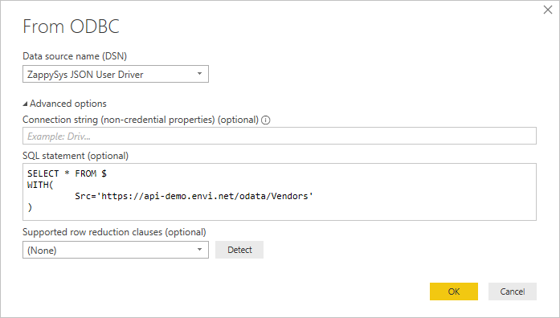
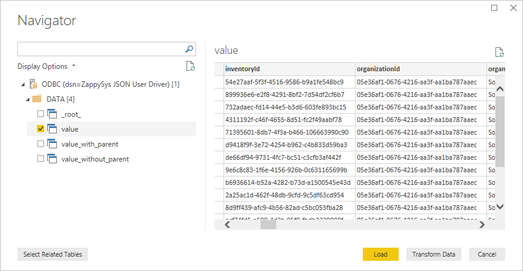
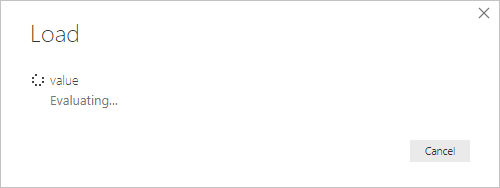
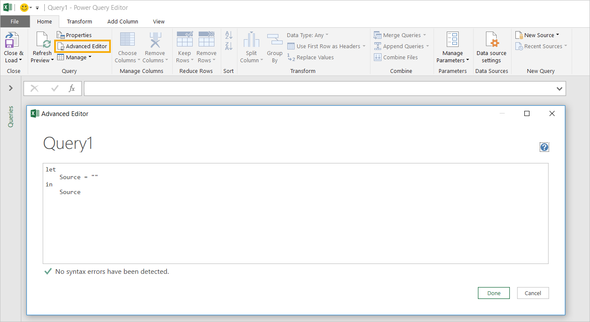
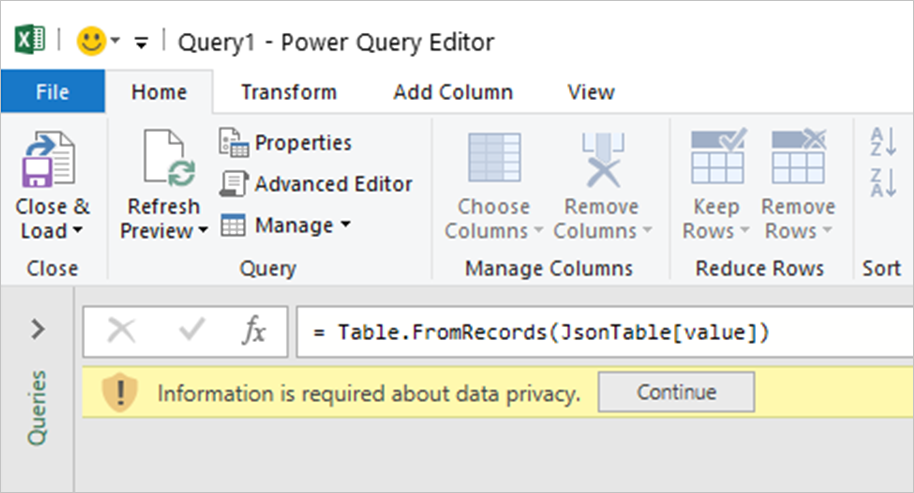
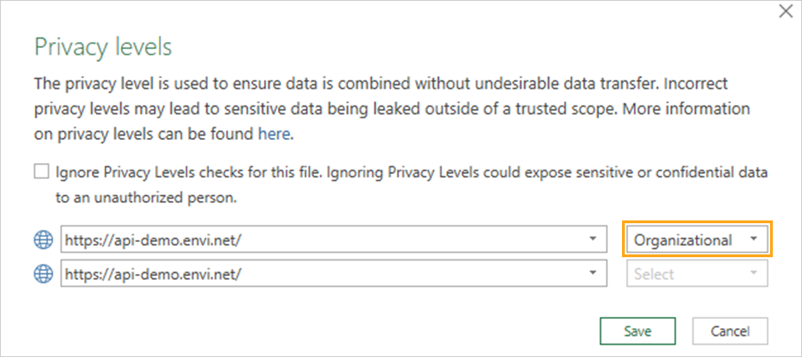
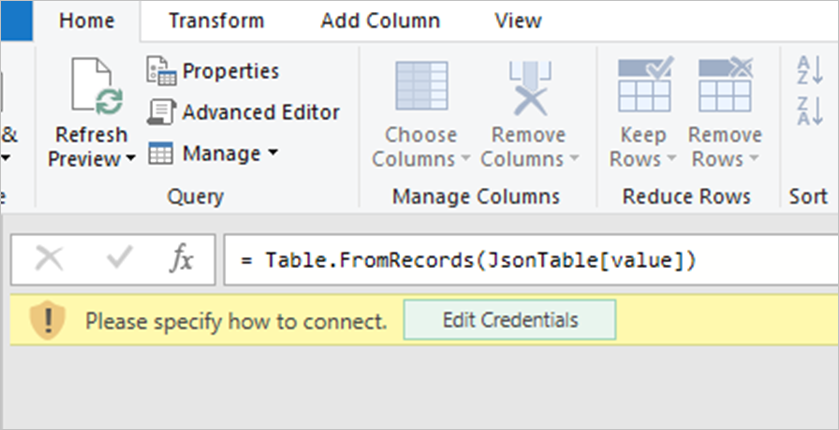

# BI Tool Use Cases
Business intelligence tools help you to improve decision making and social collaboration. Tools provide the means for efficient reporting, thorough analysis of data, statistics, and analytics.

[Power BI](#power-bi), [Excel](#ms-exel), Tableau, and Klipfolio are data visualization and business intelligence tools that convert data from different data sources to interactive dashboards and BI reports.

Security is a priority for Envi, therefore we support tools that adhere to the latest standards in secure authentication.

To easily visualize data you want in Power BI and MS Excel, create a custom query. Custom query retrieves JWT token, and then uses it in subsequent requests to the server.

## <span style="color: #F05D30">Power BI</span> 

To work with Envi data easily in Power BI, you can use the following methods:

 - [Building Custom Query](#building-custom-query)
 - [Integration with ODBC driver](#integration-with-odbc-driver)


### <span style="color: #F05D30">Building Custom Query</span> 

To create the query and use it for the data retrieving in Power BI, do the following:

 1. Select **Get Data** > **Blank Query**. 
 2. In **Power Query Editor**, select **Advanced Editor** from the **Home** tab or the **View** tab. 
 3. Use the following template to populate data from the needed endpoint. <br> Where you should populate the following data:
    - ```BASE_URL```–API URL (for example, api-demo.envi.net)
    - ```RESOURCE_RELATIVE_URL```–URL to a specific resource (for example, Inventory, Vendors, Manufacturers)
    - ```USER_NAME```, ```PASSWORD```–your credentials
    - ```DATASOURCE_NAME```–arbitrary data-source name
    - ```//Query=[ #"$filter"="", #"$orderBy"=""]```–additional query options such as ```$filter```, ```$orderBy```, ```$top```, ```$skip```, ```$search```.

    !!! note

        In case you need to use any query option, specify this line in custom query (Query=[ #"$filter"="", #"$orderBy"=""]).

    !!! note

        The 099153c2625149bc8ecb3e85e03f0022 client_id is the same for all clients.

    ``` cs title="Example"
    let
        api_base_url = "BASE_URL", // e.g. https://api-demo.envi.net/,
        resource_relative_url = "RESOURCE_RELATIVE_URL", //e.g. odata/Inventory
        user_name = "USER_NAME",
        password = "PASSWORD",
        GetJson = Json.Document(Web.Contents(api_base_url & "oauth2/token",
            [
                Headers = [#"Accept"="application/json",
                            #"Content-Type"="application/x-www-form-urlencoded;charset=UTF-8"],
                Content = Text.ToBinary("username="&user_name&"&password="&password&""&"&grant_type=password&client_id=099153c2625149bc8ecb3e85e03f0022")
            ])),
                access_token = GetJson[access_token],
                AccessTokenHeader = "Bearer " & access_token,
                JsonTable =  Json.Document(Web.Contents(
                api_base_url & resource_relative_url,
        [
        //Query=[ #"$filter"="", #"$orderBy"=""],
        Headers=[#"Authorization" = AccessTokenHeader ]
        ])),
        #"DATASOURCE_NAME" = Table.FromRecords(JsonTable[value])
        in
            #"DATASOURCE_NAME"

    ```

 4. As the sample, for data retrieving, use Inventory resource and demo environment (api-demo.envi.net). 
 5. Select the **Done** button. As the result, Excel has executed the query and the needed data is shown. 
 6. Select the **Close & Apply** icon to populate data to the Excel spreadsheet. 

Custom Query is ready for the data retrieving. To refresh data, call the context menu of the needed query with right-click, and then select **Refresh**. To modify the data, select **Edit**.

!!! note

    During the first query execution, you’ll see the warning message about data privacy and storage of the sensitive information. It is recommended to set privacy credentials to Organizational.

### <span style="color: #F05D30">Integration with ODBC Driver</span> 

You can connect Power BI with the **ODBC driver** and retrieve the needed data. For this, do the following:

 1. Open the **Power BI** sheet, then go to the **Home** tab. On **Get Data**, select **More**. 
 2. In the **Get Data** dialog box, on the **Other** tab select **ODBC**, and then select **Connect**. 
 3. From the **Data source names (DSN)** list, select **ZappySys JSON Driver** and click **OK**. 
    
    !!! note

        To specify the custom endpoint, use a query with additional parameters. For this, on the **Get Data from ODBC** dialog box, select **Advanced Options**, and then specify your query with the **Src** option. 

 4. When the data is downloaded, in the **Navigator** dialog box, expand the **DATA** folder, select value, and then click **Load**. 
The **Load** dialog box with uploading progress appears. 
5. Once the data is uploaded, a dataset along with a list of all available columns is shown. 
6. To refresh the date, select the **Refresh** icon. 
The integration with Power BI is finished. You can use retrieved data easily for your further needs.

## <span style="color: #F05D30">MS Exel</span> 
To work with Envi data easily in **MS Excel**, you can use the following methods:

 - Building Custom Query
 - Integration with ODBC driver

### <span style="color: #F05D30">Building Custom Query</span> 
To create the query and use it for data retrieving in **Excel**, do the following:

1. Go to the **Data** tab, then select **Get Data** > **From Other Sources** > **Blank Query**.  
2. In **Power Query Editor**, select **Advanced Editor** from the **Home** tab or the **View** tab.  
3. Use the following template to populate data from the needed endpoint. <br> Where you should populate the following data:

    - ```BASE_URL```–API URL (for example, api-demo.envi.net)
    - ```RESOURCE_RELATIVE_URL```–URL to a specific resource (for example, Inventory, Vendors, Manufacturers)
    - ```USER_NAME```, ```PASSWORD```–your credentials
    - ```DATASOURCE_NAME```–arbitrary data-source name
    - ```//Query=[ #"$filter"="", #"$orderBy"=""]```–additional query options such as ```$filter```, ```$orderBy```, ```$top```, ```$skip```, ```$search```.

    !!! note

        In case you need to use any query option, specify this line in custom query (Query=[ #"$filter"="", #"$orderBy"=""]).

    !!! note

        The 099153c2625149bc8ecb3e85e03f0022 client_id is the same for all clients.

    ``` cs title="Example"
    let
        api_base_url = "BASE_URL", // e.g. https://api-demo.envi.net/,
        resource_relative_url = "RESOURCE_RELATIVE_URL", //e.g. odata/Inventory
        user_name = "USER_NAME",
        password = "PASSWORD",
        GetJson = Json.Document(Web.Contents(api_base_url & "oauth2/token",
            [
                Headers = [#"Accept"="application/json",
                            #"Content-Type"="application/x-www-form-urlencoded;charset=UTF-8"],
                Content = Text.ToBinary("username="&user_name&"&password="&password&""&"&grant_type=password&client_id=099153c2625149bc8ecb3e85e03f0022")
            ])),
                access_token = GetJson[access_token],
                AccessTokenHeader = "Bearer " & access_token,
                JsonTable =  Json.Document(Web.Contents(
                api_base_url & resource_relative_url,
        [
        //Query=[ #"$filter"="", #"$orderBy"=""],
        Headers=[#"Authorization" = AccessTokenHeader ]
        ])),
        #"DATASOURCE_NAME" = Table.FromRecords(JsonTable[value])
        in
            #"DATASOURCE_NAME"

    ```

 4. As the sample, the Inventory resource and demo environment (api-demo.envi.net) can be used for data retrieving:   
 5. Select the **Done** button. As the result, **Excel** has executed the query and the needed data is shown.   
 6. Select the **Close & Load** icon to populate data to the **Excel** spreadsheet.  

Custom Query is ready for the data retrieving. To refresh data, call the context menu of the needed query with right-click, and then select **Refresh**. To modify the data, select **Edit**.

!!! note
    
    During the first query execution, you’ll see the warning message about data privacy and storage of the sensitive information. 

To resolve this issue, do the following:

1. Click **Continue** and set privacy credential to **Organizational**.  
2. Click **Save**. <br> Your choice will be saved for the given external data source (for example, api-demo.envi.net). <br> Also, you can see the message about credentials for the external data source.  


To resolve this issue, do the following:

1. Click **Edit Credentials**.  
2. Select the **Anonymous** access, and then click the **Connect** button.

Your choice will be saved for the given external data source (for example, api-demo.envi.net).